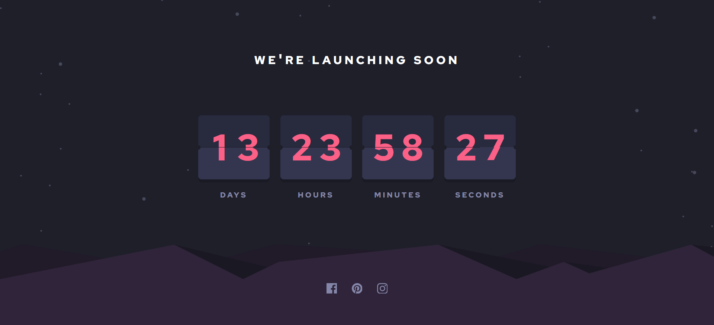

# Frontend Mentor - Launch countdown timer solution

This is a solution to the [Launch countdown timer challenge on Frontend Mentor](https://www.frontendmentor.io/challenges/launch-countdown-timer-N0XkGfyz-). Frontend Mentor challenges help you improve your coding skills by building realistic projects.

## Table of contents

- [Frontend Mentor - Launch countdown timer solution](#frontend-mentor---launch-countdown-timer-solution)
  - [Table of contents](#table-of-contents)
  - [Overview](#overview)
    - [The challenge](#the-challenge)
    - [Links](#links)
  - [My process](#my-process)
    - [Built with](#built-with)
    - [What I learned](#what-i-learned)
    - [Useful resources](#useful-resources)
  - [Author](#author)
  - [Acknowledgments](#acknowledgments)

## Overview

### The challenge

Users should be able to:

- See hover states for all interactive elements on the page
- See a live countdown timer that ticks down every second (start the count at 14 days)
- **Bonus**: When a number changes, make the card flip from the middle

### Links

- Solution URL on [Github](https://github.com/Catevika/Frontendmentor_countdown-timer_by_Catevika)
- Live Site URL on [ Github pages](https://catevika.github.io/Frontendmentor_countdown-timer_by_Catevika/)

## My process

### Built with

- **markup:** Semantic HTML5
- **styles:** CSS3
- **animation:** CSS3 + JavaScript

### What I learned

- CSS tricks to get a result as close as possible to the design recommendations
- Logic of a countdown timer with date and time
- CSS + JS card flip animation

### Useful resources

I would not have been able to create the flip javascript animation from scratch if I haven't found this amazing project. I updated the original to fit my markups in this project, added the "days" part, and it works like a charm!

- [countdownFlipClock on youtube ](https://www.youtube.com/watch?v=x00P_1meF6c)
- [countdownFlipClock on Codepen](https://codepen.io/codebubb/pen/rNvGaVq)

## Author

- English porfolio - [Catevika Portfolio EN](catevika.github.io/Catevika_Portfolio-EN/)
- French Portfolio - [Catevika Portfolio FR](catevika.github.io/Catevika_Portfolio-FR/)
- Frontend Mentor - [@Catevika](https://www.frontendmentor.io/profile/Catevika)
- Twitter - [@dominique_bello](https://twitter.com/dominique_bello)

## Acknowledgments

Thank you to **Frontendmentor** for this excellent **intermediate** project. I feel like I am going to do more of them!

Do not hesitate to visit their site!
